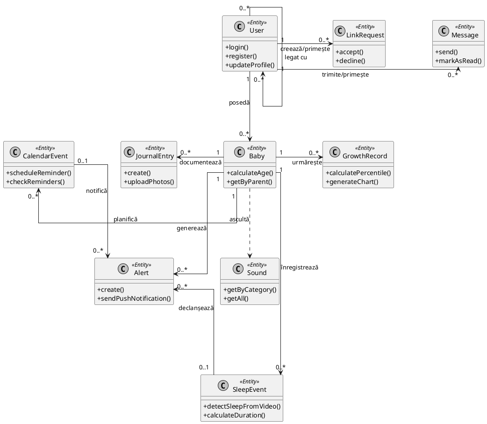
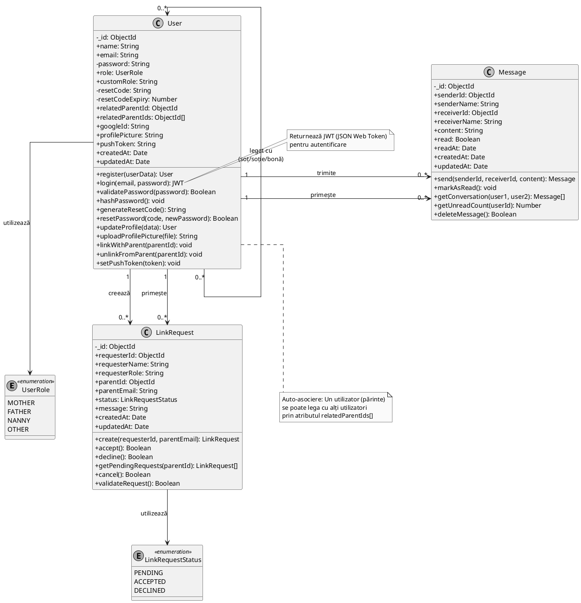
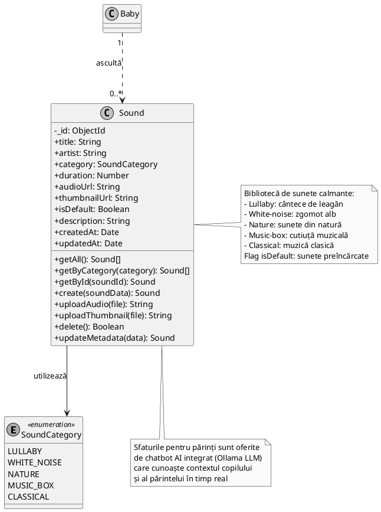

# Diagrama de Clase - Lullababy AI

## Descriere Generală

Această diagramă prezintă structura completă a claselor din aplicația Lullababy AI, incluzând toate modelele de date și relațiile dintre acestea. Pentru claritate vizuală, diagrama este împărțită în mai multe module.

## 1. Diagrama Generală - Overview

Prezintă toate clasele principale și relațiile dintre ele. **Notă**: Clasa Advice nu mai este necesară, fiind înlocuită cu un chatbot AI integrat (Ollama LLM) care oferă sfaturi personalizate în timp real.



---

## 2. Modulul Utilizatori & Comunicare

Gestionează utilizatorii, autentificarea și comunicarea între aceștia:


plantuml
@startuml
skinparam classAttributeIconSize 0
skinparam monochrome true
skinparam shadowing false
skinparam linetype ortho
skinparam ranksep 120
skinparam nodesep 80

' Enumerări
enum AlertType <<enumeration>> {
    MOTION
    CRYING
    SLEEP
    CALENDAR
    SYSTEM
}

enum SleepStatus <<enumeration>> {
    SOMN_INCEPUT
    SOMN_INCHEIAT
    FINALIZAT
}

enum BabySex <<enumeration>> {
    BOY
    GIRL
}

enum BirthType <<enumeration>> {
    NATURAL
    C_SECTION
}

class Baby {
    - _id: ObjectId
    + name: String
    + sex: BabySex
    + birthDate: Date
    + birthTime: String
    + birthWeight: Number
    + birthLength: Number
    + birthType: BirthType
    + gestationalWeeks: Number
    + knownAllergies: String
    + avatarColor: String
    + avatarImage: String
    + parentId: ObjectId
    + createdAt: Date
    + updatedAt: Date
    __
    + create(babyData): Baby
    + update(babyData): Baby
    + delete(): Boolean
    + calculateAge(): String
    + calculateAgeInMonths(): Number
    + getByParent(parentId): Baby[]
    + uploadAvatar(file): String
    + updateAllergies(allergies): void
}

class Alert {
    - _id: ObjectId
    + babyId: ObjectId
    + sleepEventId: ObjectId
    + calendarEventId: ObjectId
    + type: AlertType
    + message: String
    + title: String
    + isRead: Boolean
    + timestamp: Date
    + createdAt: Date
    + updatedAt: Date
    __
    + create(alertData): Alert
    + markAsRead(): void
    + getUnread(babyId): Alert[]
    + getByType(type): Alert[]
    + delete(): Boolean
    + sendPushNotification(): void
    + generateMotionAlert(babyId): Alert
    + generateCryingAlert(babyId): Alert
    + generateSleepAlert(babyId, status): Alert
    + generateFromCalendar(event): Alert
}

class SleepEvent {
    - _id: ObjectId
    + status: SleepStatus
    + start_time: Date
    + end_time: Date
    + duration_minutes: Number
    + device_id: String
    + detectedAutomatically: Boolean
    + createdAt: Date
    + updatedAt: Date
    __
    + startSleep(deviceId): SleepEvent
    + endSleep(): SleepEvent
    + detectSleepFromVideo(deviceId): SleepEvent
    + detectWakeFromVideo(deviceId): SleepEvent
    + calculateDuration(): Number
    + getHistory(deviceId, date): SleepEvent[]
    + getTodaySleep(deviceId): SleepEvent[]
    + getWeeklySummary(deviceId): Object
}

' Relații între clase
User "1" -down-> "0..*" Baby : posedă
Baby "1" -right-> "0..*" Alert : generează
Baby "1" -down-> "0..*" SleepEvent : înregistrează
SleepEvent "0..1" -right-> "0..*" Alert : declanșează

' Legătură cu enumerări
Baby --> BabySex : utilizează
Baby --> BirthType : utilizează
Alert --> AlertType : utilizează
SleepEvent --> SleepStatus : utilizează

note right of Alert
  Detectare automată prin AI:
  - Motion: analiză video
  - Crying: analiză audio/video
  - Sleep: analiză comportament
end note

note bottom of SleepEvent
  Evenimentele de somn sunt detectate
  automat prin camera baby monitor
  (flag detectedAutomatically)
end note

@enduml
```
plantuml
@startuml
skinparam classAttributeIconSize 0
skinparam monochrome true
skinparam shadowing false
skinparam linetype ortho
skinparam ranksep 120
skinparam nodesep 80

' Enumerări
enum JournalTag <<enumeration>> {
    MILESTONE
    FIRST_MOMENTS
    SLEEP
    FEEDING
    HEALTH
    CHALLENGES
    PLAYTIME
    OTHER
}

enum JournalMood <<enumeration>> {
    HAPPY
    OKAY
    NEUTRAL
    CRYING
    SICK
}

enum CalendarEventType <<enumeration>> {
    VACCINATION
    CHECKUP
    MILESTONE
    MEDICATION
    APPOINTMENT
    OTHER
}

class GrowthRecord {
    - _id: ObjectId
    + babyId: ObjectId
    + weight: Number
    + length: Number
    + date: Date
    + age: String
    + notes: String
    + createdAt: Date
    + updatedAt: Date
    __
    + create(babyId, data): GrowthRecord
    + update(recordId, data): GrowthRecord
    + delete(): Boolean
    + getHistory(babyId): GrowthRecord[]
    + calculateGrowthPercentile(weight, length, age): Object
    + generateGrowthChart(babyId): Object
    + compareWithStandards(babyId): Object
}

class JournalEntry {
    - _id: ObjectId
    + babyId: ObjectId
    + title: String
    + description: String
    + date: Date
    + photos: String[]
    + photoCaptions: String[]
    + tags: JournalTag[]
    + mood: JournalMood
    + createdAt: Date
    + updatedAt: Date
    __
    + create(babyId, entryData): JournalEntry
    + update(entryId, data): JournalEntry
    + delete(): Boolean
    + uploadPhotos(files): String[]
    + getByBaby(babyId): JournalEntry[]
    + getByTag(babyId, tag): JournalEntry[]
    + getByDateRange(babyId, start, end): JournalEntry[]
    + searchEntries(babyId, query): JournalEntry[]
}

class CalendarEvent {
    - _id: ObjectId
    + babyId: ObjectId
    + title: String
    + description: String
    + date: Date
    + time: String
    + type: CalendarEventType
    + completed: Boolean
    + reminder: Boolean
    + reminderDays: Number
    + autoGenerated: Boolean
    + notes: String
    + createdAt: Date
    + updatedAt: Date
    __
    + create(babyId, eventData): CalendarEvent
    + update(eventId, data): CalendarEvent
    + delete(): Boolean
    + markCompleted(): void
    + getUpcoming(babyId): CalendarEvent[]
    + getByMonth(babyId, month, year): CalendarEvent[]
    + generateVaccinationSchedule(babyId): CalendarEvent[]
    + scheduleReminder(): void
    + checkReminders(): Alert[]
}

' Relații între clase
Baby "1" -down-> "0..*" GrowthRecord : urmărește
Baby "1" -down-> "0..*" JournalEntry : documentează
Baby "1" -down-> "0..*" CalendarEvent : planifică
CalendarEvent "0..1" -right-> "0..*" Alert : notifică

' Legătură cu enumerări
JournalEntry --> JournalTag : utilizează
JournalEntry --> JournalMood : utilizează
CalendarEvent --> CalendarEventType : utilizează

note right of GrowthRecord
  Calculează percentile de creștere
  comparativ cu standarde OMS
end note

note left of JournalEntry
  Jurnal foto cu tag-uri pentru
  organizare: milestone, feeding,
  sleep, health, playtime
end note

note bottom of CalendarEvent
  Generare automată calendar
  vaccinare conform schemei
  naționale (flag autoGenerated)
end note

@enduml

## 5. Modulul Conținut

Bibliotecă de sunete calmante pentru bebeluș. **Notă**: Sfaturile pentru părinți sunt oferite de chatbot AI integrat (Ollama LLM) care cunoaște contextul copilului și al părintelui în timp real.



---

## Descrierea Claselor

### 1. User (Utilizator)
Clasa principală care gestionează utilizatorii aplicației (părinți, bone, etc.).

**Atribute principale:**
- Informații de bază: nume, email, parolă
- Rol: mother, father, nanny, others
- Autentificare: Google OAuth, reset parolă
- Notificări: push token pentru notificări push
- Relații: legături cu alți părinți

**Relații:**
- Un utilizator poate avea mai mulți bebeluși (1:N cu Baby)
- Un utilizator poate fi legat de alți utilizatori (N:N cu User)
- Un utilizator poate trimite/primi mesaje (1:N cu Message)
- Un utilizator poate crea/primi cereri de legătură (1:N cu LinkRequest)

### 2. Baby (Bebeluș)
Conține informațiile despre bebeluș.

**Atribute principale:**
- Informații de identificare: nume, sex
- Date naștere: dată, oră, greutate, lungime
- Tip naștere: natural/cezariană
- Săptămâni gestaționale
- Alergii cunoscute
- Avatar personalizat

**Relații:**
- Aparține unui utilizator părinte (N:1 cu User)
- Are alertele (1:N cu Alert)
- Are înregistrări de creștere (1:N cu GrowthRecord)
- Are intrări în jurnal (1:N cu JournalEntry)
- Are evenimente în calendar (1:N cu CalendarEvent)
- Are evenimente de somn (1:N cu SleepEvent)

### 3. Alert (Alertă)
Notificări generate automat de sistemul de monitorizare video și evenimente programate.

**Atribute principale:**
- Tip: motion (mișcare detectată), crying (plâns detectat), sleep (adormit/trezit), calendar, system
- Mesaj și titlu
- Status citire
- Timestamp

**Funcționalități detectare automată:**
- Detectare mișcare prin analiză video
- Detectare plâns prin analiză audio/video
- Detectare adormit/trezit prin analiză comportament

**Relații:**
- Aparține unui bebeluș (N:1 cu Baby)
- Poate fi legată de un eveniment de somn (N:1 cu SleepEvent)
- Poate fi legată de un eveniment din calendar (N:1 cu CalendarEvent)

### 4. GrowthRecord (Înregistrare Creștere)
Monitorizează evoluția fizică a bebelușului.

**Atribute principale:**
- Greutate
- Lungime
- Vârstă
- Note
- Data măsurării

**Relații:**
- Aparține unui bebeluș (N:1 cu Baby)

### 5. SleepEvent (Eveniment Somn)
Înregistrează perioadele de somn ale bebelușului, detectate automat prin analiză video sau introduse manual.

**Atribute principale:**
- Status: somn început, încheiat, finalizat
- Ora început/sfârșit
- Durată în minute
- ID dispozitiv (Raspberry Pi)
- Flag detectare automată

**Funcționalități:**
- Detectare automată a momentului când copilul adoarme
- Detectare automată a momentului când copilul se trezește
- Calcul automat durată somn
- Statistici și rapoarte săptămânale

### 6. JournalEntry (Intrare Jurnal)
Jurnalul zilnic al părinților despre bebeluș.

**Atribute principale:**
- Titlu și descriere
- Data
- Fotografii și legendele lor
- Tag-uri: milestone, first-moments, sleep, feeding, health, etc.
- Stare: happy, okay, neutral, crying, sick

**Relații:**
- Aparține unui bebeluș (N:1 cu Baby)

### 7. CalendarEvent (Eveniment Calendar)
Gestionează programările și evenimentele importante.

**Atribute principais:**
- Titlu, descriere, dată, oră
- Tip: vaccination, checkup, milestone, medication, appointment
- Status completare
- Reminder cu zile înainte
- Auto-generat pentru vaccinări

**Relații:**
- Aparține unui bebeluș (N:1 cu Baby)
- Poate genera alerte (1:N cu Alert)

### 8. Message (Mesaj)
Sistem de mesagerie între utilizatori.

**Atribute principale:**
- Expeditor și destinatar (ID și nume)
- Conținut mesaj
- Status citire
- Data citirii

**Relații:**
- Trimis de un utilizator (N:1 cu User)
- Primit de un utilizator (N:1 cu User)

### 9. LinkRequest (Cerere Legătură)
Gestionează cererile de conectare între utilizatori.

**Atribute principale:**
- Solicitant (ID, nume, rol)
- Părinte țintă (ID, email)
- Status: pending, accepted, declined
- Mesaj opțional

**Relații:**
- Creată de un utilizator (N:1 cu User - requester)
- Adresată unui utilizator părinte (N:1 cu User - parent)

### 10. Sound (Sunet)
Biblioteca de sunete calmante pentru bebeluș.

**Atribute principale:**
- Titlu, artist
- Categorie: lullaby, white-noise, nature, music-box, classical
- Durată
- URL audio și thumbnail
- Flag default/custom
- Descriere

**Notă**: Sfaturile pentru părinți (care anterior erau gestionate de clasa Advice) sunt acum oferite de **chatbot AI integrat** bazat pe Ollama LLM. Chatbot-ul are acces la datele despre bebeluș și părinte, oferind răspunsuri personalizate și contextuale în timp real.

## Cardinalități

| Relație | Cardinalitate | Descriere |
|---------|---------------|-----------|
| User - Baby | 1:N | Un utilizator poate avea mai mulți bebeluși |
| User - User | N:N | Utilizatorii se pot lega între ei (părinți, bone) |
| Baby - Alert | 1:N | Un bebeluș poate avea multiple alerte |
| Baby - GrowthRecord | 1:N | Un bebeluș are multiple înregistrări de creștere |
| Baby - JournalEntry | 1:N | Un bebeluș are multiple intrări în jurnal |
| Baby - CalendarEvent | 1:N | Un bebeluș are multiple evenimente în calendar |
| Baby - SleepEvent | 1:N | Un bebeluș are multiple evenimente de somn |
| SleepEvent - Alert | 1:N | Un eveniment de somn poate genera multiple alerte |
| CalendarEvent - Alert | 1:N | Un eveniment din calendar poate genera multiple alerte |
| User - Message (sender) | 1:N | Un utilizator poate trimite multiple mesaje |
| User - Message (receiver) | 1:N | Un utilizator poate primi multiple mesaje |
| User - LinkRequest (requester) | 1:N | Un utilizator poate crea multiple cereri de legătură |
| User - LinkRequest (parent) | 1:N | Un utilizator părinte poate primi multiple cereri |

## Tipuri de Date Enumerate (Enumerations)

### User.role
- `mother` - Mamă
- `father` - Tată
- `nanny` - Bonă
- `others` - Alte roluri

### Baby.sex
- `Girl` - Fată
- `Boy` - Băiat

### Baby.birthType
- `Natural` - Naștere naturală
- `C-Section` - Cezariană

### Alert.type
- `motion` - Alertă detectare mișcare
- `crying` - Alertă detectare plâns
- `sleep` - Alertă evenimente de somn (adormit/trezit)
- `calendar` - Alertă din calendar
- `system` - Alertă de sistem

### JournalEntry.tags
- `milestone` - Piatră de hotar
- `first-moments` - Prime momente
- `sleep` - Somn
- `feeding` - Alimentație
- `health` - Sănătate
- `challenges` - Provocări
- `playtime` - Timp de joacă
- `other` - Altele

### JournalEntry.mood
- `happy` - Fericit
- `okay` - Bine
- `neutral` - Neutru
- `crying` - Plânge
- `sick` - Bolnav

### CalendarEvent.type
- `vaccination` - Vaccinare
- `checkup` - Control medical
- `milestone` - Piatră de hotar
- `medication` - Medicație
- `appointment` - Programare
- `other` - Altele

### SleepEvent.status
- `Somn Inceput` - Somn început
- `Somn Incheiat` - Somn încheiat
- `Finalizat` - Finalizat

### Sound.category
- `lullaby` - Cântece de leagăn
- `white-noise` - Zgomot alb
- `nature` - Sunete din natură
- `music-box` - Cutiuță muzicală
- `classical` - Muzică clasică

### LinkRequest.status
- `pending` - În așteptare
- `accepted` - Acceptată
- `declined` - Refuzată

## Arhitectura Aplicației

### Backend (Node.js + Express)
- **Models**: Clasele MongoDB Mongoose
- **Controllers**: Logica de business pentru fiecare entitate
- **Services**: Servicii pentru operații complexe
- **Routes**: Endpoint-uri REST API
- **Middleware**: Autentificare, gestionare erori, upload fișiere

### Frontend (React Native + Expo)
- **Componente**: Interfață utilizator
- **Hooks**: Gestionare stare și efecte
- **Servicii**: Comunicare cu API-ul backend

### AI/Chatbot
- **Ollama LLM**: Model de limbaj pentru chatbot
- **Knowledge Base**: Bază de cunoștințe despre îngrijirea bebelușilor

### IoT (Raspberry Pi)
- **Cameră**: Baby monitor cu video streaming în timp real
- **Detecție AI**: Analiză video pentru detectare mișcare, plâns, adormit/trezit
- **Flask API**: Comunicare cu backend-ul pentru streaming video și alerte
- **Audio**: Captare sunet pentru detectare plâns

## Note Tehnice

- **Baza de date**: MongoDB (NoSQL)
- **ORM**: Mongoose
- **Autentificare**: JWT + Google OAuth
- **Storage**: Fișiere locale pentru imagini și sunete
- **Notificări**: Push notifications (Expo) pentru alerte în timp real
- **Streaming**: Video streaming de la camera baby monitor
- **AI/ML**: Detectare automată mișcare, plâns, adormit/trezit prin analiză video
- **Real-time**: Alertare instantanee la detectare evenimente

---

**Versiune**: 1.0  
**Data**: Februarie 2026  
**Autor**: Licență Lullababy AI
