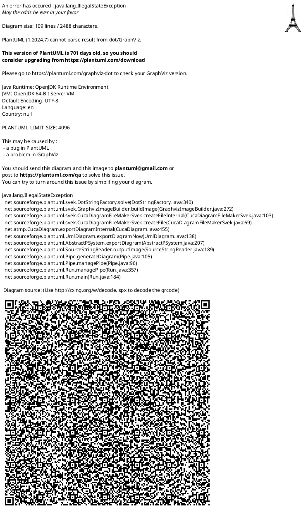

# Diagrama Funcționalități - Lullababy AI

## Descriere Generală

Această diagramă prezintă toate funcționalitățile principale ale aplicației Lullababy AI, organizate pe module funcționale. Aplicația oferă un ecosistem complet pentru monitorizarea și îngrijirea bebelușilor.

## Diagrama Completă de Funcționalități

---

## Descrierea Detaliată a Funcționalităților

### 1. Autentificare & Cont

**Obiectiv**: Gestionarea utilizatorilor și securizarea accesului la aplicație.

| Funcționalitate | Descriere | Utilizatori |
|-----------------|-----------|-------------|
| Înregistrare utilizator | Creare cont nou cu email, parolă, nume, rol | Părinți, Bone |
| Login | Autentificare cu email/parolă sau Google OAuth | Părinți, Bone |
| Reset parolă | Recuperare cont prin cod de resetare trimis pe email | Părinți, Bone |
| Editare profil | Modificare date personale (nume, email, rol custom) | Părinți, Bone |
| Upload poză profil | Încărcare imagine profil personalizată | Părinți, Bone |
| Gestionare push token | Configurare notificări push pentru alerte | Părinți, Bone |

**Tehnologii**: JWT Authentication, Google OAuth 2.0, bcrypt password hashing

---

### 2. Gestionare Bebeluș

**Obiectiv**: Administrarea informațiilor despre bebeluși.

| Funcționalitate | Descriere | Utilizatori |
|-----------------|-----------|-------------|
| Adăugare bebeluș | Creare profil bebeluș (nume, sex, dată naștere, greutate, lungime, tip naștere, săptămâni gestaționale) | Părinți |
| Editare informații | Modificare date bebeluș (actualizare informații) | Părinți |
| Upload avatar | Încărcare imagine avatar personalizat sau selectare culoare avatar | Părinți |
| Gestionare alergii | Adăugare/editare lista de alergii cunoscute | Părinți |
| Vizualizare vârstă | Calcul automat vârstă (ani, luni, zile) și luni pentru percentile | Părinți, Bone |

**Tehnologii**: MongoDB, Mongoose, File Upload

---

### 3. Baby Monitor Video

**Obiectiv**: Monitorizare în timp real cu detecție AI și alertare automată.

| Funcționalitate | Descriere | Utilizatori |
|-----------------|-----------|-------------|
| Streaming video live | Transmisie video în timp real de la camera Raspberry Pi | Părinți, Bone |
| Detectare mișcare (AI) | Analiză video automată pentru identificare mișcare bebeluș | Sistem (Raspberry Pi) |
| Detectare plâns (AI) | Analiză audio/video pentru identificare plâns | Sistem (Raspberry Pi) |
| Detectare somn/trezire (AI) | Analiză comportament pentru detectare adormire/trezire | Sistem (Raspberry Pi) |
| Alertare push notification | Trimitere notificări push instant la detectare evenimente | Părinți, Bone |

**Tehnologii**: Raspberry Pi, Flask API, OpenCV, AI/ML models, Expo Push Notifications

**Tipuri alerte**:
- 🚶 **Motion**: Mișcare detectată
- 😭 **Crying**: Plâns detectat
- 😴 **Sleep**: Adormit
- 👁️ **Wake**: Trezit

---

### 4. Monitorizare Somn

**Obiectiv**: Urmărirea tiparelor de somn și generare statistici.

| Funcționalitate | Descriere | Utilizatori |
|-----------------|-----------|-------------|
| Înregistrare somn automat | Detectare automată adormire/trezire prin camera video | Sistem (Raspberry Pi) |
| Înregistrare somn manual | Adăugare manuală evenimente somn de către părinte | Părinți |
| Vizualizare istoric | Afișare listă evenimente somn (zilnic, săptămânal, lunar) | Părinți, Bone |
| Statistici săptămânale | Rapoarte agregare: total ore somn, medie, număr sesiuni | Părinți |
| Calcul durată somn | Calcul automat durată între ora de adormire și trezire | Sistem |

**Metrici**:
- Durată totală somn (ore și minute)
- Număr sesiuni somn
- Durată medie pe sesiune
- Ore de adormire/trezire

---

### 5. Creștere & Dezvoltare

**Obiectiv**: Monitorizarea evoluției fizice și comparare cu standarde OMS.

| Funcționalitate | Descriere | Utilizatori |
|-----------------|-----------|-------------|
| Înregistrare greutate/lungime | Adăugare măsurători periodice (kg, cm) | Părinți |
| Calcul percentile OMS | Calcul automat percentile conform standarde WHO | Sistem |
| Generare grafice creștere | Vizualizare grafice evoluție greutate/lungime în timp | Părinți |
| Comparare cu standarde | Comparare percentile bebeluș cu curbe standard WHO | Sistem |
| Vizualizare evoluție | Afișare istoric complet măsurători cu note | Părinți |

**Standarde WHO**: Percentile pentru greutate și lungime pe sex și vârstă (0-24 luni).

---

### 6. Jurnal Foto

**Obiectiv**: Documentare momente importante și dezvoltare bebeluș.

| Funcționalitate | Descriere | Utilizatori |
|-----------------|-----------|-------------|
| Creare intrare jurnal | Adăugare notă zilnică cu titlu și descriere | Părinți |
| Upload fotografii | Încărcare imagini multiple cu legende | Părinți |
| Adăugare tag-uri | Etichetare intrări: milestone, first-moments, sleep, feeding, health, challenges, playtime | Părinți |
| Selectare stare (mood) | Indicare dispoziție bebeluș: happy, okay, neutral, crying, sick | Părinți |
| Căutare după tag/dată | Filtrare intrări jurnal pe perioadă sau categorie | Părinți, Bone |
| Vizualizare jurnal | Afișare cronologică intrări cu fotografii | Părinți, Bone |

**Tag-uri disponibile**:
- 🎉 **Milestone**: Pietre de hotar
- 👶 **First moments**: Prime momente
- 😴 **Sleep**: Somn
- 🍼 **Feeding**: Alimentație
- 🏥 **Health**: Sănătate
- 😰 **Challenges**: Provocări
- 🎮 **Playtime**: Joacă
- 📝 **Other**: Altele

---

### 7. Calendar & Planificare

**Obiectiv**: Organizarea programărilor medicale și evenimente importante.

| Funcționalitate | Descriere | Utilizatori |
|-----------------|-----------|-------------|
| Creare eveniment | Adăugare programări personalizate (titlu, dată, oră, tip, note) | Părinți |
| Generare calendar vaccinări automat | Creare automată calendar vaccinări conform schemei naționale România | Sistem |
| Setare reminder-uri | Configurare notificări cu X zile înainte de eveniment | Părinți |
| Marcare eveniment completat | Bifează evenimente efectuate | Părinți |
| Vizualizare evenimente viitoare | Afișare liste evenimente pe lună sau viitoare | Părinți, Bone |

**Tipuri evenimente**:
- 💉 **Vaccination**: Vaccinare
- 🏥 **Checkup**: Control medical
- 🎂 **Milestone**: Piatră de hotar
- 💊 **Medication**: Medicație
- 📅 **Appointment**: Programare
- 📝 **Other**: Altele

**Reminder-uri**: Alerte trimise cu 1, 3, 7 zile înainte (configurabil).

---

### 8. Sunete Calmante

**Obiectiv**: Bibliotecă audio pentru liniștirea bebelușului.

| Funcționalitate | Descriere | Utilizatori |
|-----------------|-----------|-------------|
| Căutare sunete pe categorie | Filtrare după tip: lullaby, white-noise, nature, music-box, classical | Părinți, Bone |
| Redare sunet | Player audio pentru redare continuă | Părinți, Bone |
| Upload sunet custom | Încărcare fișiere audio personalizate | Părinți |
| Gestionare playlist | Organizare sunete favorite | Părinți |

**Categorii sunete**:
- 🎵 **Lullaby**: Cântece de leagăn
- 🌊 **White-noise**: Zgomot alb
- 🌿 **Nature**: Sunete din natură
- 🎁 **Music-box**: Cutiuță muzicală
- 🎼 **Classical**: Muzică clasică

**Sunete default**: Aplicația vine cu bibliotecă preîncărcată de sunete.

---

### 9. Chatbot AI

**Obiectiv**: Asistent virtual personalizat pentru sfaturi și suport.

| Funcționalitate | Descriere | Utilizatori |
|-----------------|-----------|-------------|
| Întrebare către chatbot | Trimitere întrebări în limbaj natural | Părinți, Bone |
| Sfaturi personalizate pe context | Răspunsuri adaptive bazate pe vârsta bebelușului și date profil | Chatbot AI (Ollama) |
| Răspunsuri despre îngrijire bebeluș | Informații despre: alăptare, somn, colicii, febră, dinți, dezvoltare | Chatbot AI (Ollama) |
| Suport emoțional părinte | Sfaturi pentru depresie postpartum, anxietate, epuizare | Chatbot AI (Ollama) |

**Baza de cunoștințe**: 
- Breastfeeding
- Sleep patterns
- Crying & colic
- Fever & illness
- Teething
- Emotional support
- Postpartum depression

**Tehnologie**: Ollama LLM cu acces la context (date bebeluș, istoric, vârstă).

---

### 10. Comunicare & Conectare

**Obiectiv**: Colaborare între părinți, bone și alte persoane de îngrijire.

| Funcționalitate | Descriere | Utilizatori |
|-----------------|-----------|-------------|
| Trimitere cerere legătură | Solicitare conectare la alt utilizator prin email | Părinți, Bone |
| Acceptare/Refuzare cerere | Aprobare sau respingere cereri de legătură | Părinți |
| Trimitere mesaj | Comunicare directă între utilizatori conectați | Părinți, Bone |
| Citire mesaje | Vizualizare conversații, marcare mesaje citite | Părinți, Bone |
| Vizualizare conversații | Acces istoric complet mesaje cu timestamp | Părinți, Bone |

**Scenarii de conectare**:
- Mamă ↔ Tată (soți)
- Părinte ↔ Bonă
- Părinte ↔ Bunici
- Părinte ↔ Alt părinte (familie extinsă)

**Status cereri**: Pending, Accepted, Declined

---

## Fluxuri Principale de Utilizare

### Flux 1: Setup Inițial
1. **Înregistrare cont** → Login
2. **Adăugare bebeluș** → Completare informații (nume, dată naștere, etc.)
3. **Configurare push notifications**
4. **Conectare cu partener/bonă** (opțional)

### Flux 2: Monitorizare Zilnică
1. **Acces streaming video** → Monitorizare live
2. **Primire alertă** (mișcare/plâns/trezire) → Push notification
3. **Vizualizare istoric somn** → Statistici
4. **Redare sunet calmant** (opțional)

### Flux 3: Documentare Dezvoltare
1. **Adăugare intrare jurnal** → Upload fotografii
2. **Înregistrare măsurători** (greutate/lungime) → Vezi grafice
3. **Creare evenimente calendar** → Setare reminder

### Flux 4: Asistență AI
1. **Deschidere chatbot**
2. **Întrebare**: "Copilul plânge mult, ce să fac?"
3. **Răspuns personalizat** bazat pe vârsta copilului
4. **Sugestii contextuale**

---

## Tehnologii Utilizate

### Frontend
- **React Native** + **Expo** (aplicație mobilă iOS/Android)
- **TypeScript** pentru type safety
- **React Navigation** pentru navigare

### Backend
- **Node.js** + **Express.js** (REST API)
- **MongoDB** + **Mongoose** (bază de date NoSQL)
- **JWT** + **Google OAuth** (autentificare)
- **Multer** (upload fișiere)

### IoT & AI
- **Raspberry Pi** (camera baby monitor)
- **Flask API** (Python - streaming video)
- **OpenCV** + **AI/ML models** (detectare mișcare, plâns, somn)
- **Ollama LLM** (chatbot AI)

### Notificări & Comunicare
- **Expo Push Notifications** (alerte în timp real)
- **Socket.io** sau polling pentru actualizări live

---

## Metrici Cheie

- **Număr total funcționalități**: 50+
- **Module principale**: 10
- **Actori sistem**: 4 (Părinți, Bone, Raspberry Pi, Chatbot AI)
- **Tipuri alerte AI**: 4 (motion, crying, sleep, wake)
- **Categorii sunete**: 5
- **Tipuri evenimente calendar**: 6
- **Tag-uri jurnal**: 8
- **Standarde medicale**: WHO/OMS

---

## Note de Securitate

- **Autentificare**: JWT tokens cu expirare, bcrypt hashing
- **Autorizare**: Role-based access (mamă, tată, bonă, alt)
- **Date sensibile**: Criptare parolă, protecție date medicale
- **Privacy**: GDPR compliant, date stocate local
- **Video streaming**: Conexiune securizată între Raspberry Pi și backend

---

**Versiune**: 1.0  
**Data**: Februarie 2026  
**Autor**: Licență Lullababy AI
