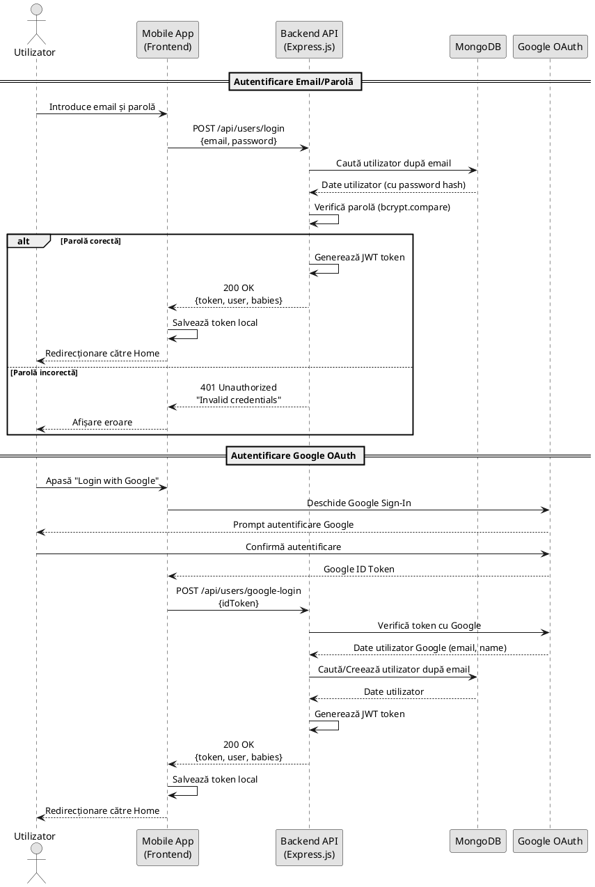
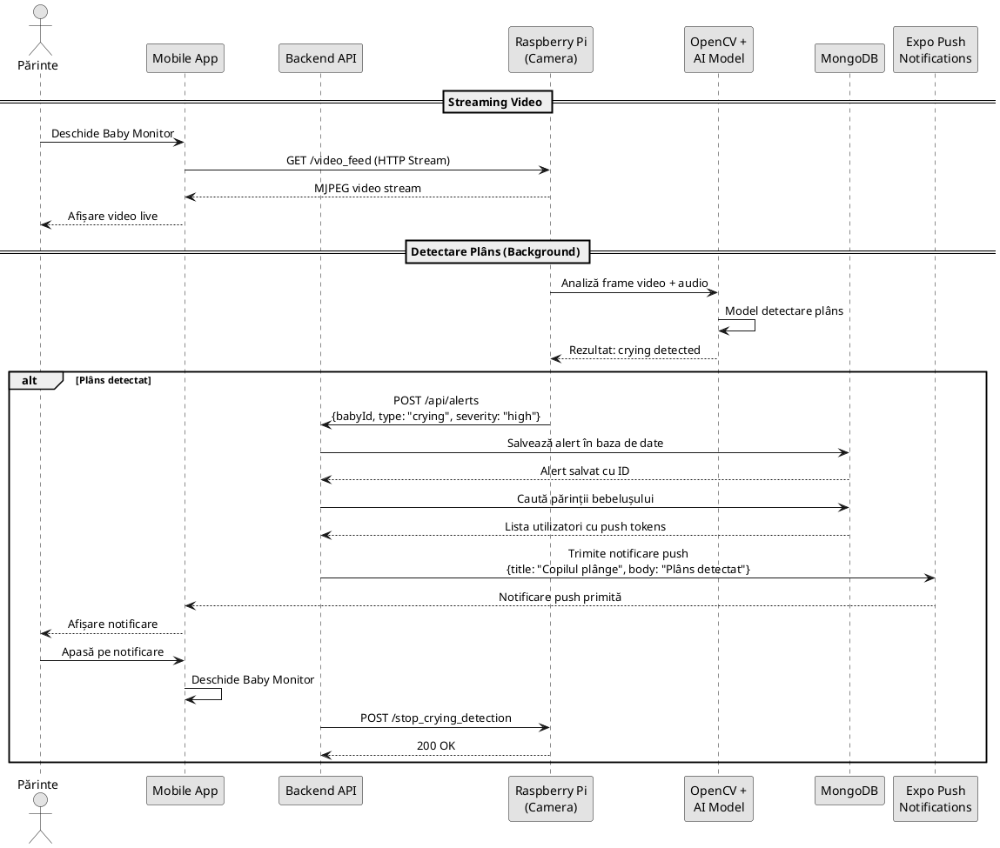
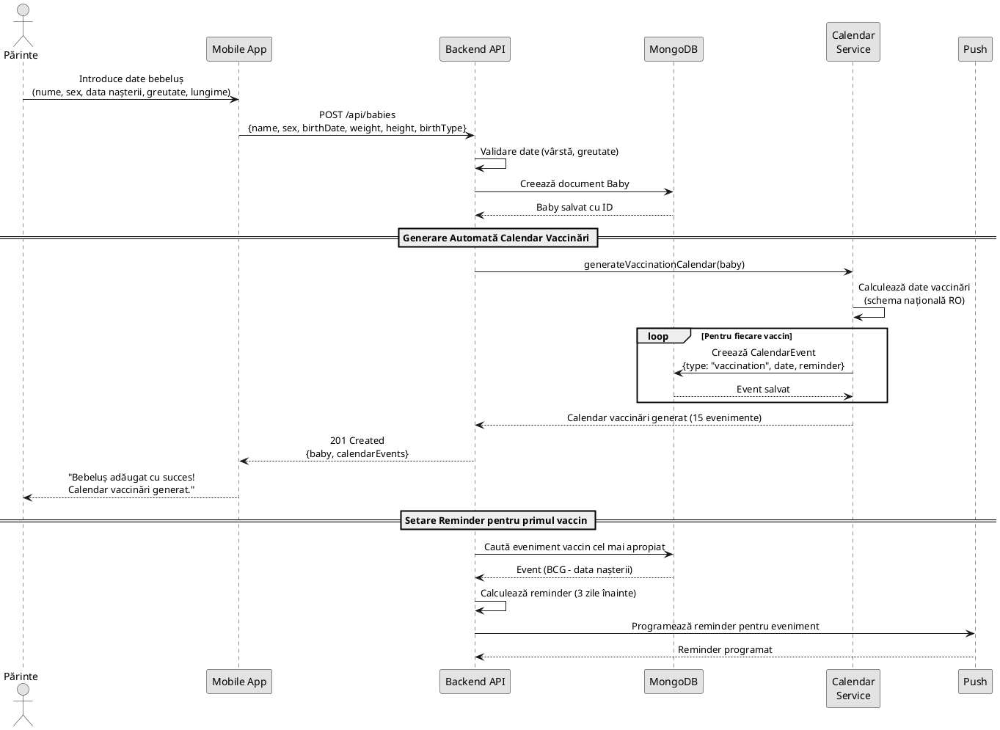
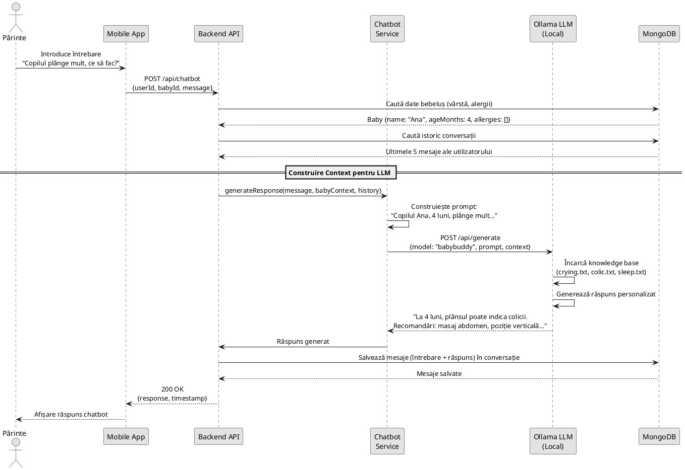
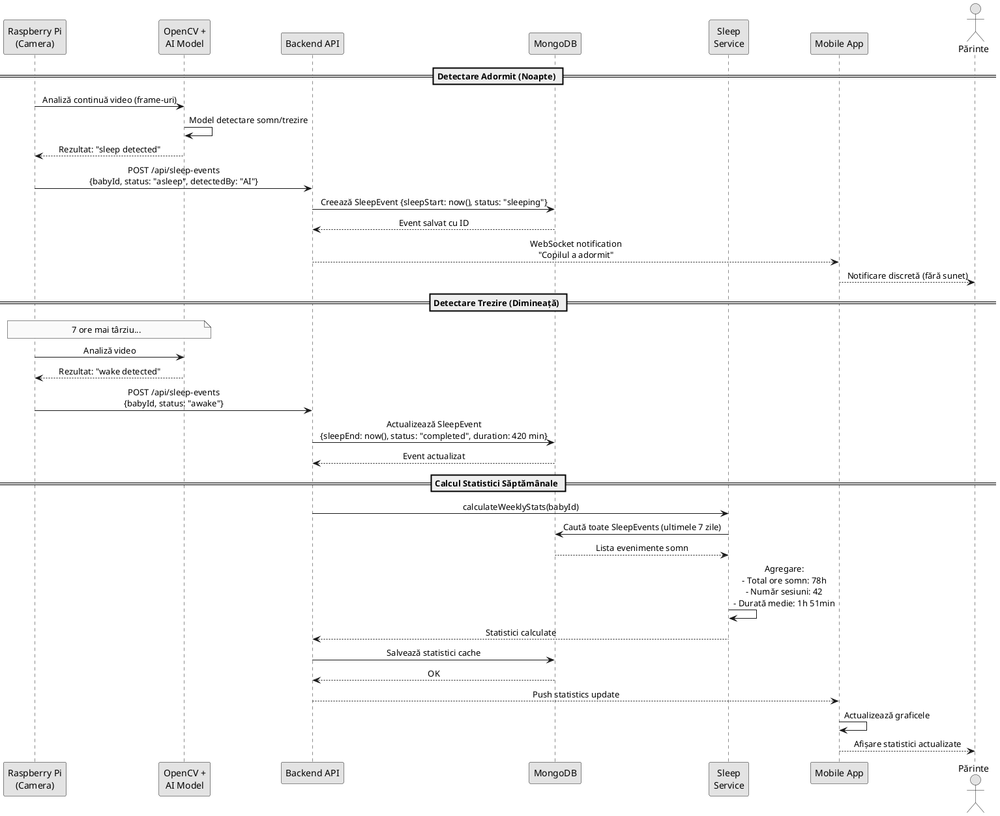
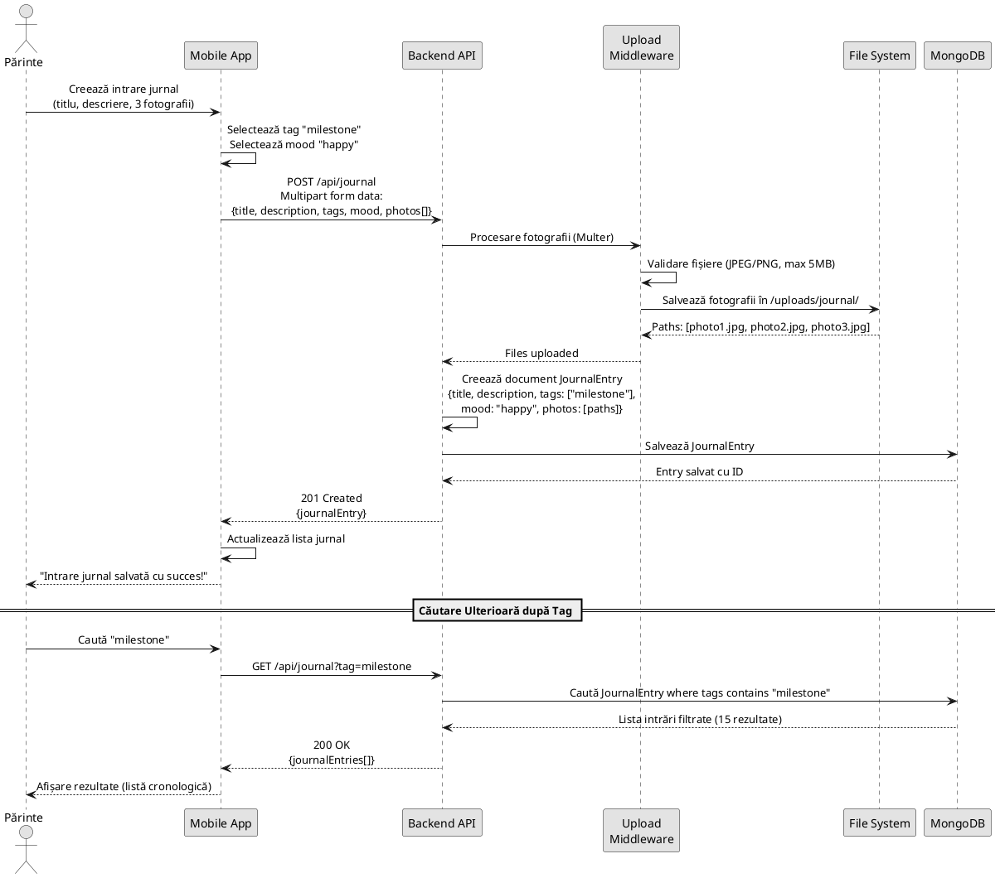
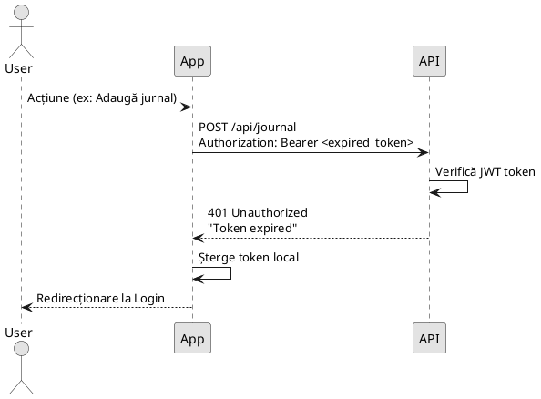
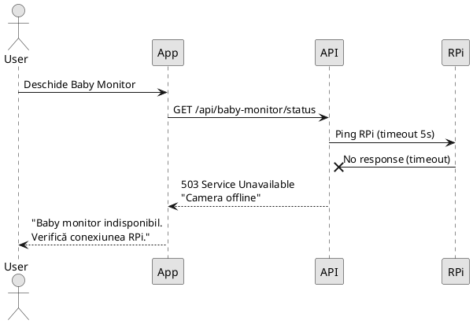

# Diagrame de Secvență - Lullababy AI

## Descriere Generală

Diagramele de secvență prezintă interacțiunile temporale dintre componentele sistemului Lullababy AI pentru cele mai importante fluxuri funcționale. Acestea ilustrează comunicarea între frontend (aplicație mobilă), backend (API REST), baza de date, Raspberry Pi și serviciile AI.

---

## 1. Diagramă Secvență: Autentificare și Login

Acest flux descrie procesul de autentificare a unui utilizator prin email/parolă sau Google OAuth.

**Actori și Componente:**
- **Utilizator**: Părinte sau Bonă care dorește să se autentifice
- **Mobile App**: Aplicație React Native + Expo
- **Backend API**: Server Node.js + Express.js
- **MongoDB**: Bază de date NoSQL pentru utilizatori
- **Google OAuth**: Serviciu extern de autentificare Google

**Tehnologii:**
- JWT (JSON Web Tokens) pentru sesiuni
- bcrypt pentru hashing parole
- Google OAuth 2.0 pentru autentificare socială

---

## 2. Diagramă Secvență: Monitorizare Video și Detectare AI cu Alertare

Acest flux descrie detectarea automată a plânsului prin AI și trimiterea notificării push către părinți.

**Actori și Componente:**
- **Raspberry Pi**: Camera cu senzori video/audio
- **OpenCV + AI Model**: Algoritmi de computer vision pentru detectare
- **Expo Push Notifications**: Serviciu pentru notificări mobile

**Tipuri de alerte:**
- **Motion**: Mișcare detectată
- **Crying**: Plâns detectat (severitate: high)
- **Sleep**: Adormit (severitate: low)
- **Wake**: Trezit (severitate: medium)

---

## 3. Diagramă Secvență: Adăugare Bebeluș și Generare Calendar Vaccinări

Acest flux arată cum se creează profilul unui bebeluș și cum sistemul generează automat calendarul de vaccinări.

**Schema Vaccinări Națională România:**
1. **La naștere**: BCG, Hepatită B (doza 1)
2. **2 luni**: DTP, Poliomielită, Hib, Hepatită B (doza 2)
3. **4 luni**: DTP, Poliomielită, Hib
4. **6 luni**: DTP, Poliomielită, Hib, Hepatită B (doza 3)
5. **12 luni**: ROR (rujeolă, oreion, rubeolă)
6. **15 luni**: DTP booster

**Calendar Service**: Funcție automată care generează 15+ evenimente de vaccinare bazate pe data nașterii.

---

## 4. Diagramă Secvență: Chatbot AI - Întrebare și Răspuns Contextualizat

Acest flux ilustrează cum chatbot-ul AI (Ollama LLM) răspunde la întrebări folosind contextul bebelușului.

**Baza de Cunoștințe Ollama:**
- `breastfeeding.txt`: Ghid alăptare
- `crying.txt`: Cauze plâns și soluții
- `colic.txt`: Gestionarea colicilor
- `fever.txt`: Febră și când să mergi la medic
- `sleep.txt`: Tiparele de somn pe vârste
- `teething.txt`: Erupția dentară
- `postpartum.txt`: Suport pentru depresie postpartum

**Personalizare:**
- Răspunsurile includ numele bebelușului
- Ține cont de vârstă (4 luni → colicii comune)
- Consideră alergii cunoscute
- Păstrează context conversație (ultimele 5 mesaje)

---

## 5. Diagramă Secvență: Înregistrare Automată Somn și Statistici

Acest flux arată detectarea automată a adormitului prin AI și calculul statisticilor de somn.

**Metrici Calculate:**
- **Durată totală somn**: Suma tuturor sesiunilor (ore și minute)
- **Număr sesiuni**: Câte perioade de somn (diurn + nocturn)
- **Durată medie**: Total somn / număr sesiuni
- **Ore adormire/trezire**: Pattern detectat (ex: 21:00 - 07:00)

**Detectare AI:**
- Analiză video continuă (OpenCV)
- Model antrenat pe comportament bebeluș
- Precizie: ~85% pentru detectare somn/trezire
- Fără detecție false pozitive prin mișcare mică

---

## 6. Diagramă Secvență: Upload Intrare Jurnal cu Fotografii

Acest flux arată cum părintele documentează un moment important cu fotografii și tag-uri.

**Tag-uri Disponibile:**
- `milestone`: Pietre de hotar (primul cuvânt, primi pași)
- `first-moments`: Prime momente (primul zâmbet)
- `sleep`: Documentare somn
- `feeding`: Alimentație
- `health`: Sănătate (vizite medic)
- `challenges`: Provocări (dentiție, colicii)
- `playtime`: Joacă și dezvoltare
- `other`: Alte categorii

**Mood (Stare):**
- `happy` 😊: Fericit
- `okay` 😐: Okay
- `neutral` 😑: Neutru
- `crying` 😢: Plâns
- `sick` 🤒: Bolnav

---

## Fluxuri de Eroare și Excepții

### Eroare: Token JWT Expirat

### Eroare: Raspberry Pi Offline

---

## Tehnologii Utilizate în Diagrame

### Frontend (Mobile App)
- **React Native** + **Expo**: Framework aplicație mobilă
- **AsyncStorage**: Salvare JWT token local
- **React Navigation**: Navigare între ecrane

### Backend (API)
- **Node.js** + **Express.js**: Server REST API
- **JWT (jsonwebtoken)**: Autentificare și autorizare
- **Multer**: Middleware pentru upload fișiere
- **bcrypt**: Hashing parole

### Baza de Date
- **MongoDB**: Bază NoSQL pentru date structurate
- **Mongoose**: ODM pentru validare și query-uri

### IoT & AI
- **Raspberry Pi**: Camera baby monitor (Flask API Python)
- **OpenCV**: Procesare video și detectare
- **Ollama LLM**: Model AI local pentru chatbot
- **Expo Push Notifications**: Alertare instant

### Comunicare
- **HTTP/REST**: Comunicare client-server
- **WebSocket** (opțional): Notificări real-time
- **MJPEG Streaming**: Video live de la Raspberry Pi

---

## Note Arhitecturale

### Securitate
- Toate cererile (exceptând login/register) necesită **JWT token** în header `Authorization: Bearer <token>`
- Parolele sunt **hash-ate** cu bcrypt (salt rounds: 10)
- Fișierele uploadate sunt **validate** (tip MIME, dimensiune max)
- Video streaming este **securizat** prin autentificare

### Performanță
- Statistici somn sunt **cache-uite** în MongoDB pentru acces rapid
- Notificări push sunt **asincrone** (nu blochează răspunsul API)
- Upload fotografii folosește **streaming** (nu încarcă tot fișierul în memorie)

### Scalabilitate
- Backend poate fi **orizontal scalat** (multiple instanțe cu load balancer)
- MongoDB suportă **sharding** pentru volume mari de date
- Raspberry Pi poate fi **replicat** pentru multiple camere (același bebeluș)

---

**Versiune**: 1.0  
**Data**: Februarie 2026  
**Autor**: Licență Lullababy AI
