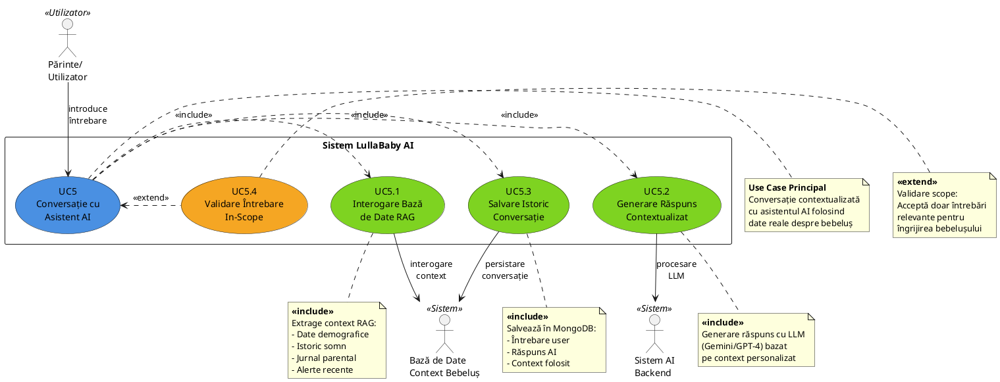

# UC5: Conversație cu Asistent AI - Descriere Detaliată

## 1. Diagrama de Caz de Utilizare (PlantUML)



### Cum să folosești diagrama:

**Online (pentru previzualizare)**:
1. Copiază codul de mai sus
2. Deschide: [PlantUML Online Editor](http://www.plantuml.com/plantuml/uml/)
3. Lipește codul și generează diagrama

**Local (pentru lucrarea de diplomă)**:
1. Instalează PlantUML: `choco install plantuml` (Windows) sau descarcă de pe plantuml.com
2. Salvează codul într-un fișier `UC5.puml`
3. Generează PNG: `plantuml UC5.puml`
4. Include imaginea în document

**În LaTeX**:
```latex
\usepackage{plantuml}
\begin{plantuml}
  % codul de mai sus
\end{plantuml}
```

### Legenda:
- **<<include>>**: Relație obligatorie - sub-procesul este întotdeauna executat
- **<<extend>>**: Relație opțională - sub-procesul este executat doar în anumite condiții
- **BLUE**: Use case principal
- **GREEN**: Sub-procese obligatorii (include)
- **ORANGE**: Sub-proces opțional (extend)

---

## 2. Descriere Tabelară Standard Academic

### UC5: Conversație cu Asistent AI

| **Câmp**                    | **Descriere**                                                                                                                                                                                                                                                                                                                                                           |
|-----------------------------|-------------------------------------------------------------------------------------------------------------------------------------------------------------------------------------------------------------------------------------------------------------------------------------------------------------------------------------------------------------------------|
| **Cod Caz de Utilizare**    | UC5                                                                                                                                                                                                                                                                                                                                                                     |
| **Nume**                    | Conversație cu Asistent AI                                                                                                                                                                                                                                                                                                                                              |
| **Actori**                  | - **Primar**: Utilizator (Părinte)<br>- **Secundari**: Sistem AI (Backend), Bază de Date (Context RAG), Model LLM (Gemini/OpenAI)                                                                                                                                                                                                                                      |
| **Scop**                    | Oferirea de răspunsuri personalizate și contextuale la întrebările utilizatorului legate de îngrijirea bebelușului, bazate pe datele colectate despre profilul și istoricul copilului.                                                                                                                                                                                 |
| **Descriere**               | Utilizatorul introduce o întrebare în chat despre bebelușul său (ex: "De ce plânge bebelușul meu?", "Cât ar trebui să doarmă la această vârstă?"). Sistemul interoghează baza de date pentru a obține contextul relevant (vârstă, greutate, înălțime, obiceiuri de somn, jurnal parental), apoi folosește un model LLM pentru a genera un răspuns personalizat și util. |
| **Precondițiil**            | 1. Utilizatorul este autentificat în aplicație<br>2. Există un profil de bebeluș creat în sistem<br>3. Baza de date conține cel puțin date de bază despre bebeluș (nume, vârstă, data nașterii)<br>4. Serviciul AI (chatbot) este funcțional și conectat la LLM<br>5. Conexiune activă la internet                                                                    |
| **Postcondițiil**           | 1. Răspunsul generat este afișat utilizatorului în interfața de chat<br>2. **✅ Conversația (întrebare + răspuns) este salvată în colecția `ChatHistory` din MongoDB**<br>3. Contextul utilizat pentru răspuns este stocat în câmpul `contextUsed` pentru îmbunătățirea viitoare<br>4. Evenimentul de interacțiune este logat pentru analiză (response time, model folosit)<br>5. Utilizatorul poate accesa istoricul conversațiilor oricând                                                                          |
| **Flux Principal**          | **1.** Utilizatorul accesează secțiunea de Chat AI din aplicație<br>**2.** Utilizatorul introduce o întrebare în câmpul de text<br>**3.** Utilizatorul apasă butonul "Trimite" sau tasta Enter<br>**4.** **<<include>>** Sistemul validează dacă întrebarea este în domeniul aplicației (UC5.4)<br>**5.** **<<include>>** Sistemul interoghează baza de date pentru a colecta contextul relevant despre bebeluș (UC5.1):<br>&nbsp;&nbsp;&nbsp;&nbsp;- Date demografice (vârstă, greutate, înălțime)<br>&nbsp;&nbsp;&nbsp;&nbsp;- Istoric somn (ultimele evenimente de somn)<br>&nbsp;&nbsp;&nbsp;&nbsp;- Jurnal parental (ultimele intrări)<br>&nbsp;&nbsp;&nbsp;&nbsp;- Alerte recente (plâns, trezire)<br>&nbsp;&nbsp;&nbsp;&nbsp;- Recomandări medicale existente<br>**6.** **<<include>>** Sistemul construiește prompt-ul pentru LLM incluzând:<br>&nbsp;&nbsp;&nbsp;&nbsp;- Întrebarea utilizatorului<br>&nbsp;&nbsp;&nbsp;&nbsp;- Contextul extras din baza de date<br>&nbsp;&nbsp;&nbsp;&nbsp;- Instrucțiuni de sistem (rol expert în pediatrie)<br>**7.** **<<include>>** Sistemul trimite cererea către modelul LLM (UC5.2)<br>**8.** **<<include>>** LLM-ul generează răspunsul personalizat bazat pe context<br>**9.** Sistemul procesează și formatează răspunsul primit<br>**10.** Răspunsul este afișat utilizatorului în interfața de chat<br>**11.** **<<include>>** Sistemul salvează conversația în baza de date (UC5.3):<br>&nbsp;&nbsp;&nbsp;&nbsp;- Mesajul utilizatorului<br>&nbsp;&nbsp;&nbsp;&nbsp;- Răspunsul AI<br>&nbsp;&nbsp;&nbsp;&nbsp;- Timestamp<br>&nbsp;&nbsp;&nbsp;&nbsp;- ID-ul bebelușului asociat<br>**12.** Utilizatorul poate continua conversația sau închide chat-ul |
| **Flux Alternativ 1**       | **FA1: Întrebare în afara domeniului (Out of Scope)**<br>**4a.** Sistemul detectează că întrebarea nu este relevantă pentru îngrijirea bebelușului<br>**4b.** Sistemul afișează un mesaj politicos: *"Îmi pare rău, sunt specializat doar în întrebări legate de îngrijirea bebelușului tău. Te rog să reformulezi întrebarea."*<br>**4c.** Fluxul revine la pasul 2     |
| **Flux Alternativ 2**       | **FA2: Eroare de conexiune la LLM**<br>**7a.** Cererea către LLM eșuează din cauza problemelor de rețea sau API<br>**7b.** Sistemul reîncearcă automat de până la 3 ori<br>**7c.** Dacă toate încercările eșuează, se afișează mesajul: *"Momentan nu pot răspunde. Te rog să încerci din nou în câteva momente."*<br>**7d.** Fluxul se termină<br>**7e.** Eroarea este logată pentru debugging |
| **Flux Alternativ 3**       | **FA3: Lipsa datelor despre bebeluș**<br>**5a.** Sistemul constată că nu există suficiente date în baza de date pentru context<br>**5b.** LLM-ul generează un răspuns generic, dar util, bazat doar pe întrebare<br>**5c.** Sistemul sugerează utilizatorului să completeze profilul bebelușului pentru răspunsuri mai personalizate<br>**5d.** Fluxul continuă la pasul 9 |
| **Flux Alternativ 4**       | **FA4: Întrebare sensibilă medicală**<br>**4a.** Sistemul detectează cuvinte cheie care indică o urgență medicală (febră înaltă, convulsii, etc.)<br>**4b.** LLM-ul generează un răspuns care prioritizează siguranța: *"Pentru simptomele descrise, te recomand să contactezi un medic pediatru imediat."*<br>**4c.** Fluxul continuă normal                          |
| **Flux de Excepție 1**      | **FE1: Bază de date indisponibilă**<br>**5a.** Conexiunea la baza de date eșuează<br>**5b.** Sistemul afișează: *"Serviciul este temporar indisponibil. Te rog să încerci mai târziu."*<br>**5c.** Eroarea este logată și echipa tehnică este notificată<br>**5d.** Fluxul se termină                                                                                |
| **Flux de Excepție 2**      | **FE2: Timeout la generarea răspunsului**<br>**8a.** LLM-ul nu răspunde în intervalul maxim permis (30 secunde)<br>**8b.** Sistemul anulează cererea<br>**8c.** Se afișează: *"Procesarea durează mai mult decât expected. Te rog să încerci cu o întrebare mai simplă."*<br>**8d.** Fluxul se termină                                                                |
| **Frecvență de Utilizare**  | Mare - aproximativ 5-10 interacțiuni per utilizator per zi                                                                                                                                                                                                                                                                                                              |
| **Prioritate**              | Critică - Este o funcționalitate cheie (core feature) a aplicației                                                                                                                                                                                                                                                                                                      |
| **Reguli de Business**      | 1. Răspunsurile trebuie să fie personalizate pe baza datelor reale ale bebelușului<br>2. Sistemul nu oferă diagnostic medical, ci doar sfaturi generale<br>3. În cazul întrebărilor medicale urgente, se recomandă consultarea unui medic<br>4. Răspunsurile trebuie să fie în limba română<br>5. Istoricul conversațiilor este păstrat maximum 90 de zile conform GDPR<br>6. Datele sensibile nu sunt transmise către terți fără consimțământ explicit |
| **Cerințe Non-Funcționale** | 1. **Performance**: Răspunsul trebuie generat în maximum 5 secunde (ideal < 3 secunde)<br>2. **Securitate**: Toate comunicațiile sunt criptate (HTTPS/TLS)<br>3. **Privacy**: Datele utilizatorului nu sunt folosite pentru training LLM<br>4. **Availabilitate**: Serviciul trebuie disponibil 99.5% din timp<br>5. **Scalabilitate**: Sistemul trebuie să suporte minimum 100 utilizatori concurenți<br>6. **Usability**: Interfața chat trebuie să fie intuitivă, similară aplicațiilor de mesagerie populare |
| **Puncte de Extensie**      | 1. Integrare cu asistență vocală (voice input/output)<br>2. Sugestii automate de întrebări frecvente<br>3. Export conversații în format PDF<br>4. Partajare conversații cu medicul pediatru<br>5. Analiza sentiment pentru detectarea stresului parental                                                                                                              |
| **Tehnologii Implicate**    | - **Frontend**: React Native (TypeScript)<br>- **Backend**: Node.js + Express<br>- **AI/LLM**: Google Gemini API / OpenAI GPT-4<br>- **Bază de Date**: MongoDB (pentru context și istoric)<br>- **RAG Framework**: Custom implementation/LangChain<br>- **Autentificare**: JWT tokens                                                                                 |
| **Note Suplimentare**       | - Sistemul folosește tehnica RAG (Retrieval-Augmented Generation) pentru a îmbunătăți acuratețea răspunsurilor<br>- Prompt engineering este optimizat pentru domeniul pediatric<br>- **✅ Conversațiile sunt salvate în MongoDB (colecția `chathistories`) cu ștergere automată după 90 zile**<br>- **✅ Utilizatorii pot accesa istoricul prin `GET /api/chatbot/history`**<br>- Plan viitor: mecanism de feedback pentru calitatea răspunsurilor (thumbs up/down)<br>- Plan viitor: întrebările frecvente vor fi cache-uite pentru performanță mai bună                             |

---

## 3. Sub-Procese Detaliate

### UC5.1: Interogare Bază de Date pentru Context RAG

**Scop**: Extragerea informațiilor relevante despre bebeluș pentru contextualizarea răspunsului AI.

**Proces**:
1. Identificare ID bebeluș activ pe baza sesiunii utilizatorului
2. Interogare colecție `babies` pentru date demografice
3. Interogare colecție `sleep_events` pentru ultimele 5 evenimente de somn
4. Interogare colecție `journal_entries` pentru ultimele 3 intrări în jurnal
5. Interogare colecție `growth_records` pentru ultimele măsurători
6. Interogare colecție `alerts` pentru alerte recente (ultimele 24h)
7. Agregare și formatare context într-un obiect JSON structurat

**Output**: Obiect context cu toate datele relevante

---

### UC5.2: Generare Răspuns Contextualizat cu LLM

**Scop**: Generarea unui răspuns personalizat folosind modelul de limbaj și contextul extras.

**Proces**:
1. Construire system prompt cu rol AI (expert pediatru virtual)
2. Injectare context în prompt:
   ```
   Context despre bebelușul [Nume]:
   - Vârstă: [X] luni
   - Ultima oară a dormit: [timestamp]
   - Greutate actuală: [X] kg
   - Intrări recente în jurnal: [...]
   ```
3. Adăugare întrebare utilizator la prompt
4. Trimitere cerere către API LLM (Gemini/OpenAI)
5. Procesare răspuns și extragere text generat
6. Validare răspuns (nu conține informații dăunătoare)

**Output**: Răspuns text formatat

---

### UC5.3: Salvare Istoric Conversație

**Scop**: Persistarea conversației pentru referințe viitoare și îmbunătățire continuă.

**Proces**:
1. Creare document în colecția `chathistories` pentru mesajul utilizatorului:
   ```javascript
   {
     userId: ObjectId,
     babyId: ObjectId || null,
     role: 'user',
     content: 'întrebarea utilizatorului',
     language: 'ro',
     createdAt: ISODate,
     updatedAt: ISODate
   }
   ```
2. Creare document pentru răspunsul AI:
   ```javascript
   {
     userId: ObjectId,
     babyId: ObjectId || null,
     role: 'assistant',
     content: 'răspunsul generat de AI',
     language: 'ro',
     contextUsed: {
       babyAge: 6,
       babyWeight: 7.5,
       babyLength: 67,
       userName: 'Maria',
       userRole: 'mother'
     },
     metadata: {
       responseTime: 1234,
       model: 'gemini',
       knowledgeFilesUsed: ['sleep.txt', 'crying.txt']
     },
     createdAt: ISODate,
     updatedAt: ISODate
   }
   ```
3. Actualizare statistici utilizare chatbot
4. **Curățare automată**: Conversațiile mai vechi de 90 de zile sunt șterse automat (GDPR compliance)

**Output**: Confirmarea salvării în baza de date

**API pentru acces istoric**:
- `GET /api/chatbot/history?babyId=xxx&limit=50` - Obține conversațiile utilizatorului
- `DELETE /api/chatbot/history` - Șterge tot istoricul utilizatorului

---

### UC5.4: Validare Întrebare In-Scope (<<extend>>)

**Scop**: Verificarea că întrebarea este relevantă pentru domeniul aplicației.

**Proces**:
1. Analiza întrebării cu liste de cuvinte cheie:
   - **In-scope**: bebeluș, somn, plâns, hrănire, creștere, greutate, etc.
   - **Out-of-scope**: politică, sport, rețete pentru adulți, etc.
2. Calculare scor de relevantă
3. Dacă scor < prag minim → Întrebare respinsă politicos
4. Dacă scor ≥ prag → Continuare flux normal

**Output**: Boolean (valid/invalid)

---

## 4. Diagrama de Secvență (Bonus)

```
Utilizator -> Frontend: Introduce întrebare
Frontend -> Backend: POST /api/chatbot/ask
Backend -> MongoDB: Query context bebeluș
MongoDB -> Backend: Return context data
Backend -> LLM API: POST cu prompt + context
LLM API -> Backend: Return răspuns generat
Backend -> MongoDB: Save conversation
Backend -> Frontend: Return răspuns
Frontend -> Utilizator: Afișare răspuns
```

---

## 5. Criterii de Acceptare (Testing)

| **ID** | **Criteriu**                                                                 | **Rezultat Așteptat**                                           |
|--------|------------------------------------------------------------------------------|-----------------------------------------------------------------|
| CA1    | Utilizator pune întrebare validă despre somn                                 | Răspuns personalizat generat în < 5 secunde                     |
| CA2    | Utilizator pune întrebare irelevantă ("Cine a câștigat meciul?")            | Mesaj politicos de refuz afișat                                 |
| CA3    | Baza de date nu conține date despre bebeluș                                  | Răspuns generic util + sugestie completare profil               |
| CA4    | API LLM este offline                                                         | Mesaj de eroare prietenos după 3 reîncercări                    |
| CA5    | Istoricul conversației este accesat                                          | Toate întrebările și răspunsurile anterioare sunt afișate       |
| CA6    | Întrebare conține cuvinte cheie medicale urgente ("febră 40 grade")          | Răspuns prioritizează consultarea medicului                     |
| CA7    | Utilizator trimite întrebare fără să fie autentificat                        | Redirecționare către ecranul de login                           |

---

## 6. Metrici de Succes

- **Rata de răspuns**: > 95% din întrebări primesc răspuns valid
- **Timp mediu de răspuns**: < 3 secunde
- **Satisfacție utilizator**: > 80% feedback pozitiv (thumbs up)
- **Acuratețe context**: > 90% răspunsuri folosesc date reale ale bebelușului
- **Rata de erori**: < 2% erori tehnice

---

**Autor**: Ionela  
**Data**: 25 Februarie 2026  
**Versiune**: 1.0
